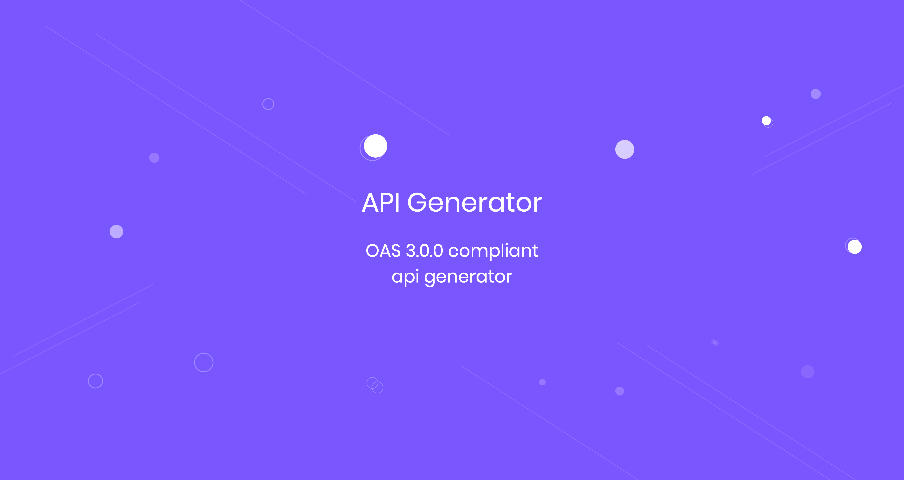
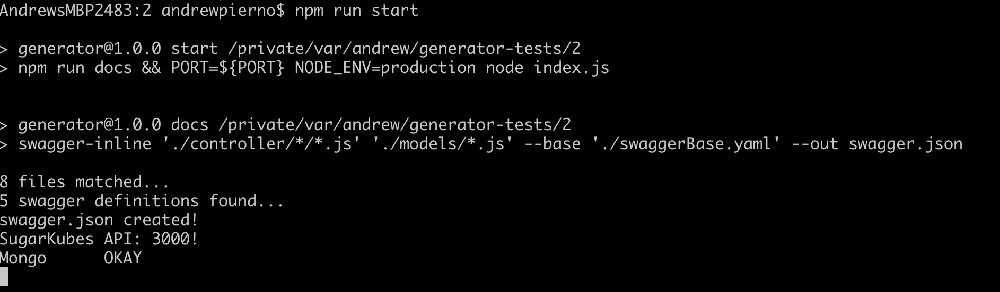
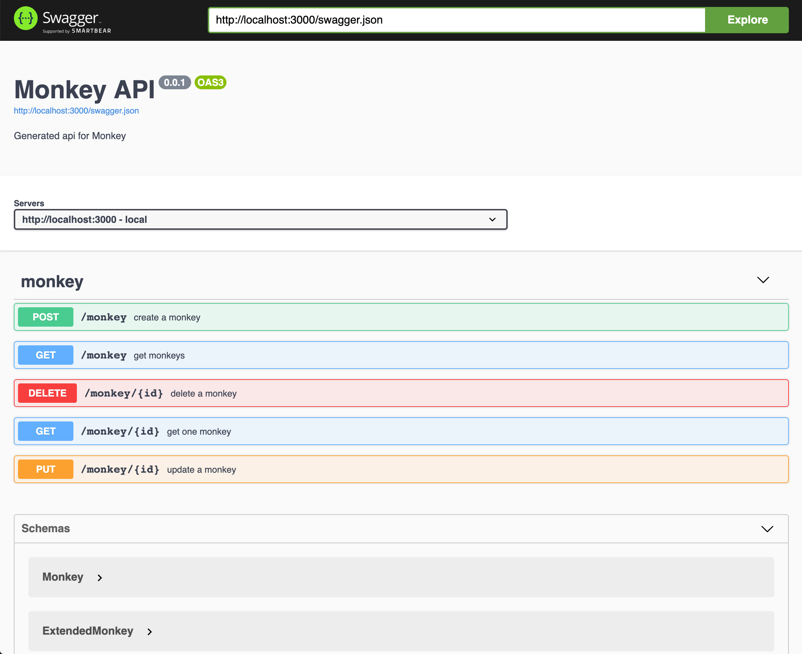

# Instantly Generate OAS 3.0 compliant APIs 🔥




## Install

```sh
npm i -g sugar-generator
```

## Prereqs

- have mongodb [installed and running](https://treehouse.github.io/installation-guides/mac/mongo-mac.html)!

- have nodejs installed

## Getting Started

1. Create your schema. It could be as simple as:

```json
{
  "schema": {
    "name": {
      "type": "String",
      "default": ""
    },
    "isDead": {
      "type": "Boolean",
      "default": false
    },
    "age": {
      "type": "Number",
      "default": false
    }
  },
  "statics": {}
}
```
save this to **monkey.json**

2. generate your api

```sh
sugar-generator \
--type api \
--name monkey \
--schema monkey.json \
--destination /wrannaman/generator
```

3. Run or build the docker container and visit [http://localhost:3000](http://localhost:3000)

```sh
cd /wrannaman/generator
npm i
npm start
# Or build the docker container!
docker build -t myMonkeys:0.1.0 .
```





## Features 🙉
- Generates simple Nodejs code
- Uses Mongodb with Mongoose ORM
- Easy to build / deploy
- Dockerfile included
- Generates CRUD APIs
  - create
  - get (many, with pagination; supports search, sort, filter, pagination out of the box)
  - getOne
  - update
  - delete

## What it's good at 🙊

- Generating an initial API
- Microservice oriented
- Ready to deploy (build with docker => deploy)

## What it's not good at (yet) 🙈

- idempotent changes (i.e. it doesn't know if you wrote code in there or changed things around)
- working with modified code
- populating table joins
- custom actions inside controller functions

# How It Works

1. Feed it a json schema (see below's [Example Schema](#Example-Schema))
2. Name it
3. Tell it where to put the code.
4. Build your generated code with the docker file
5. Deploy it and move on

## TODO

- ~~basic generator tests~~
- more tests on get
- tests for generated code
- other databases?
- **your ideas?**
- react components for the api?!?!

## Example Schema

```js
{
  "schema": {
    "first_name": {
      "type": "String",
      "default": ""
    },
    "last_name": {
      "type": "String",
      "default": ""
    },
    "email": {
      "type": "String",
      "trim": true,
      "required": true,
      "unique": true,
      "immutable": true, // Don't let this change from api on update
    },
    "password": {
      "type": "String",
      "trim": true,
      "select": false,
      "immutable": true, // Don't let this change from api on update
    },
    "intro": {
      "type": "Boolean",
      "default": false
    },
    "team": {
      "type": "ObjectId", // This references another collection
      "ref": "Team"
    },
    "sub": {
      "one": {
        "type": "String",
        "trim": true,
        "required": true
      },
      "two": {
        "type": "Number",
        "required": true
      }
    },
    "role": {
      "type": "String",
      "enum": ["user", "maker"],
      "default": "user"
    }
  },
  "statics": {
    "statuses": ["created", "under_review", "listed", "deleted"],
    "status": {
      "active": "active",
      "inactive": "inactive",
      "deleted": "deleted"
    }
  }
}

```


## Generated project structure

    .
    ├── configs                 # Config File
    ├── connection              # DB Connections (mongo, redis)
    ├── controller              # Controllers
    │   ├── <model name>        # Functions (one file, one function) create, delete, update, get, getOne
    ├── models                  # DB Models
    ├── router                  # Endpoint Routes
    ├── tests                   # Single Test File

## Generated tests

```sh
npm run test
```
